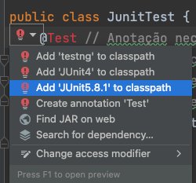

# Sobre

Repositório focado para turma de POO - Cesmac - 2022.2

## Links úteis
- [IntelliJ Download](https://www.jetbrains.com/pt-br/idea/download/#section=windows)
- [Java Doc - JDK 18](https://docs.oracle.com/en/java/javase/18/)
- 2Devs Podcast:
  - [SimpleCast](https://2devs.simplecast.com/)
  - [Spotify](https://open.spotify.com/show/5PhTDolt2xc9gne9AAUaPL)

## Como serão distribuídas as notas

1. P1
  - Exercícios
  - Revisões de Código - Pull Requests
  - Provas manuscritas
  - Projeto integrado com a turma
2. P2
  - Exercícios
  - Revisões de Código - Pull Requests
  - Provas manuscritas
  - Projeto integrado com a turma
3. P3
  - Prova simulando um teste de seleção para uma Empresa
  - Projeto integrado com outras disciplinas

## Git

### Baixando o projeto pela primeira vez

1. Abrir IntelliJ -> Menu inferior - Terminal
2. Você irá baixar o projeto utilizando um comando do git. Executar no terminal:
  - `git clone https://github.com/rachidcalazans/cesmac-poo-2022-2.git`
3. Ao abrir o IntelliJ novamente, clicar em Abrir-> selecionar a pasta que você acabou de baixar
4. Pronto, você estará com o projeto aberto no IntelliJ

### Atualizando o projeto

1. Abrir IntelliJ
2. Menu inferior - Terminal
3. Comando para ir para a `branch` principal:
  - `git checkout main`
4. Comando para atualizar a `branch` principal com atualizações que estão no Github:
  - `git fetch`
  - `git pull`
5. Agora seu projeto estará atualizado com os novos códigos do Github para a branch `main`

### Criando uma nova branch para fazer os exercícios/provas etc

1. Abrir IntelliJ
2. Menu inferior - Terminal
3. Comando para verificar em qual `branch` você está:
  - `git branch`
  - Deverá mostrar `main`, caso contrário, execute o seguinte código para ir para a branch `main`:
    - `git checkout main`
3. Estando na branch `main`, execute o comando para criar uma nova `branch` baseado na principal, a `main`:
  - `git checkout -b rachid/exercicio01`
  - `rachid/exercicio01` é o nome da nova branch. Ela deve ser o seu primeiro nome + o exercício ou desafio ou prova que irá realizar
4. Comando para enviar essa nova branch para o Github
  - `git push -u origin rachid/exercicio01`
5. Agora você poderá trabalhar na nova branch

### Subindo o código da sua nova branch para o Github

1. Abrir IntelliJ
2. Menu inferior - Terminal
3. Comando para verificar o status do seu código. Deverá mostrar em vermelho tudo que não está pronto para ser enviado
  - `git status`
4. Comando para adicionar tudo que você fez para deixar pronto para ser enviado
  - `git add .`
5. Checar novamente o status para ver todo o código alterado na cor verde
  - `git status`
6. Comando para dizer que o código está pronto para ser enviado. Será feito um `commit` do código
  - `git commit -m "Messagem do que você fez"`
7. Agora seu código está pronto para ser enviado para o Github. Comando para enviar
  - `git push -u origin rachid/exercicio01`
    - Lembrar de trocar `rachid/exercicio01` pelo nome da sua branch

### Criando Pull Request da nova branch

1. Ir até o Github, no projeto.
2. Assim que você fez o `git push` da sua nova branch. Irá aparecer uma messagem para você no repositório com um botão verde "Criar Pull Request"
3. Clique no botão "Criar Pull Request"
4. Coloque um título do Pull Request
5. Coloque uma descrição do Pull Request
6. Clique no botão  "Criar Pull Request"
7. Pronto, agora seu Pull Request foi criado e poderá ser revisado por outros desenvolvedores

## Setup

1. Adicionar o JDK no projeto
   - Ele é responsável por compilar o código em Java
   - 
   - 
   - Selecionar o JDK versão 18
   - 
2. Toda pasta de `test` deverá ser marcada como `Tests Source Root`
   1. 
   2. Clicar com botão direito e marcar como `Tests Source Root`
   3. 
3. Para adicionar o JUnit - framework de teste
   1. Se no teste o `@Test` ou `Assertions.assertEquals` em vermelho, significa que o JUnit ainda não foi importado ou adicionado no projeto
   2. 
   3. Clicar na lâmpada vermelha e selecionar a opção para adicionar o JUnit 5.8.1 no classpath
   4. 
   5. Lembrar de marcar para fazer o Download
   6. 
